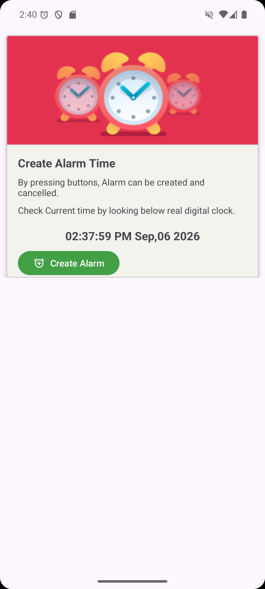
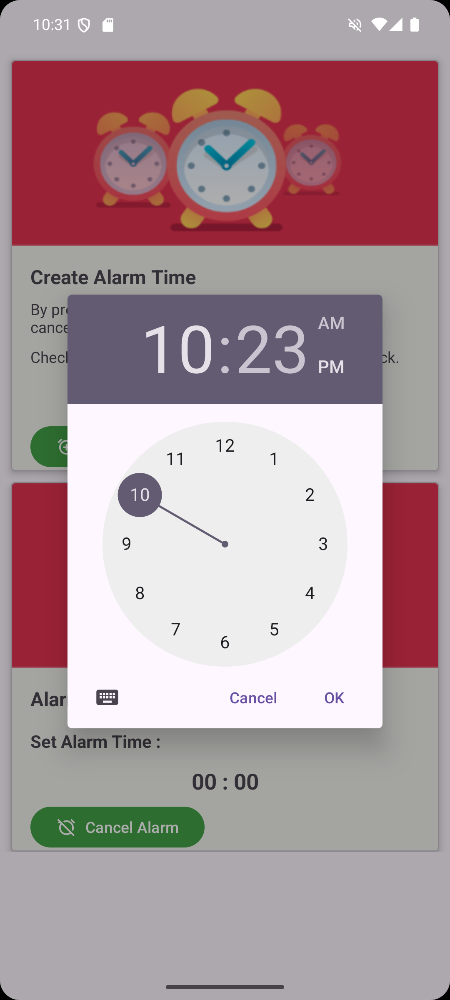
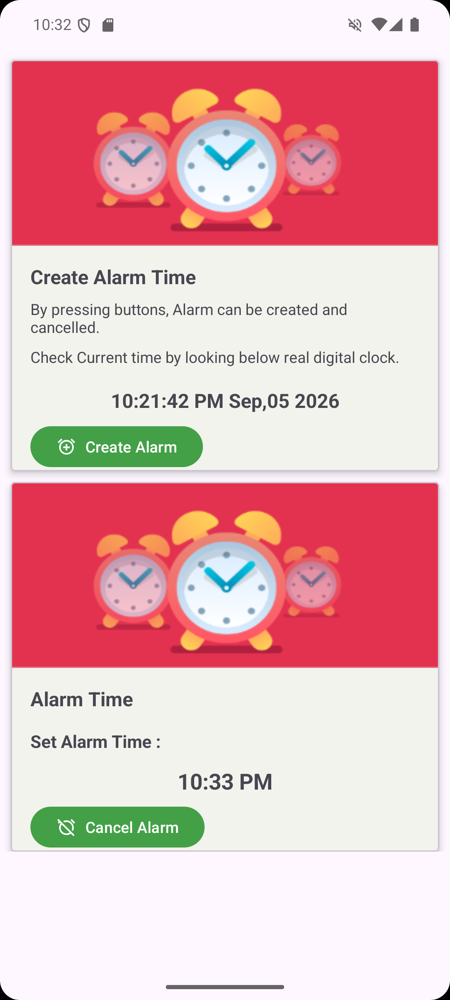
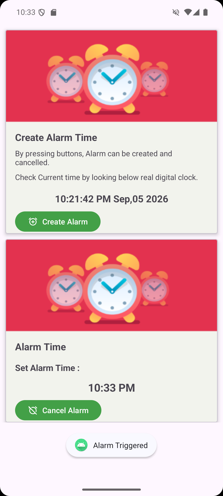

# Practical-4 
 
**Aim:** Create an Android Alarm application by using service & BroadcastReceiver. 
 
## Project Description 
This application demonstrates how to schedule tasks in Android using the `AlarmManager` and how to handle background tasks using a `Service` and a `BroadcastReceiver`. 
 
### Key Components: 
- **MainActivity**: The user interface where users can select a time using a `TimePickerDialog`. It calculates the remaining time and schedules the alarm. 
- **AlarmManager**: Used to schedule the alarm at a precise time, even if the application is not running. 
- **AlarmBroadcastReceiver**: A background component that wakes up when the alarm triggers. It receives the intent from `AlarmManager` and starts the `AlarmService`. 
- **AlarmService**: A background service that manages the playback of the alarm ringtone using `MediaPlayer`. It ensures the music continues playing until the user cancels it. 
- **Material Design UI**: Uses `MaterialCardView`, `MaterialButton`, and `TextClock` for a modern, responsive user interface. 
 
## Screenshots 
 
<table> 
  <tr> 
    <td></td> 
    <td></td> 
    <td></td> 
  </tr> 
  <tr> 
    <td colspan="3" align="center"></td> 
  </tr> 
</table> 
 
---

## Student Details

- **Enrollment No:** 24012011140
- **Practical:** 04
- **Subject:** Mobile Application Development (MAD)

---

## Conclusion

The Practical 4 application successfully demonstrates the implementation of an Android Alarm application using `AlarmManager`, `Service`, and `BroadcastReceiver`. The application allows users to schedule an alarm at a selected time and uses the `BroadcastReceiver` to trigger the `AlarmService`, which manages the alarm sound using `MediaPlayer`.

Through this practical, the working of background services, broadcast receivers, alarm scheduling, and communication between Android components was understood and implemented successfully.